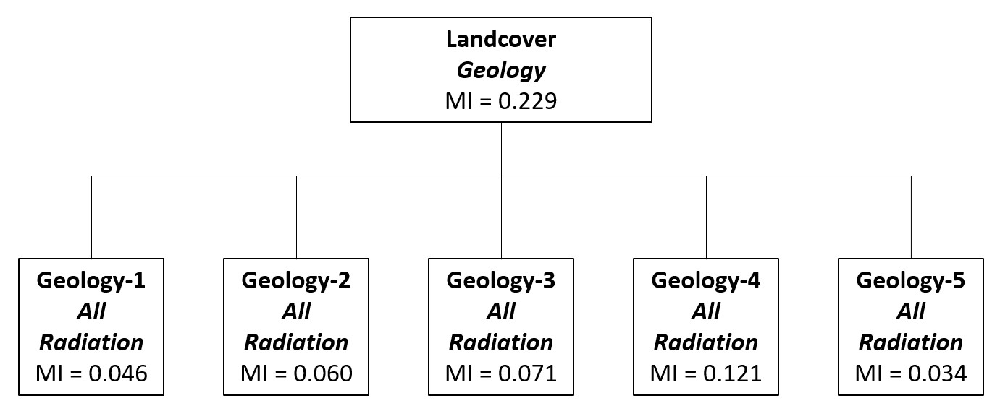

```{r setup, include=FALSE}
knitr::opts_chunk$set(echo = TRUE,
                      message = FALSE,
                      warning = FALSE)

# required packages

library(tidyverse)
library(entropy)
library(here)
library(kableExtra)
library(janitor)

```

Here, we are using environmental factors classify land use/land cover pattern in a region of northern Santa Barbara Count. The data are extracted from GIS grids in the ESM215\data\sy_data folder.

```{r data}
# read data
sydat <- read.csv(here("week_2/ex2_sample_data.csv"),
                  header=TRUE,
                  na.strings=c(-9999)) %>% 
  na.omit()

##define variables as factors and set levels for ordinal data (not required for MI analysis but useful for other classifier methods)
sydat[,c(2:6)] <- lapply(sydat[,c(2:6)],factor)
levels(sydat$winter_rad3) <- c(1,2,3)
levels(sydat$all_rad3) <- c(1,2,3)
levels(sydat$flowcum3) <- c(1,2,3)

```

## Entropy Calculations

```{r entropy}

##entropy of the dependent variable (landcover)
i_landcov <- entropy.empirical(table(sydat$landcover))

##First level MIA: calculate mutual information of land cover with
##geology, flow accumulation classes and solar radiation classes
mi_landcov_geol <- table(sydat$landcover,sydat$geology) %>% mi.empirical()
mi_landcov_flow <- table(sydat$landcover,sydat$flowcum3) %>% mi.empirical()
mi_landcov_allrad <- table(sydat$landcover,sydat$all_rad3) %>% mi.empirical()
mi_landcov_winrad <- table(sydat$landcover,sydat$winter_rad3) %>% mi.empirical()
mia_level1 <- rbind(mi_landcov_geol,mi_landcov_flow,mi_landcov_allrad,mi_landcov_winrad)

mia_level1 %>% 
  kbl(
    caption = "Table 1. Mutual Information with Landcover"
  ) %>% 
  kable_classic()

```

Geology has the highest mutual information with landcover, ie. it explains the variation best.

## Redundancy

```{r redund}

r_landcov_geol <- mi_landcov_geol/i_landcov
r_landcov_flow <- mi_landcov_flow/i_landcov
r_landcov_allrad <- mi_landcov_allrad/i_landcov
r_landcov_winrad <- mi_landcov_winrad/i_landcov

r_phys <- tibble(
  r_landcov_geol,
  r_landcov_flow,
  r_landcov_allrad,
  r_landcov_winrad
) %>% 
  pivot_longer(r_landcov_geol:r_landcov_winrad, "variable", values_to = "redundancy") %>% 
  adorn_totals()

```


## Further Categorization

```{r}
##Loop through each of 5 geology classes to calculate the MI of landcover with
##flow accumulation, annual and winter radiation.

mi_flow_2 <- NULL
for(i in c(1:5)){
  
  y <- filter(sydat,geology == i)
  
  x <- table(y$landcover,y$flowcum3) %>% 
    mi.empirical()
  
  mi_flow_2 <- c(mi_flow_2,x)
  
}


mi_allrad_2 <- NULL
for(i in c(1:5)){
  
  y <- filter(sydat,geology == i)
  
  x <- table(y$landcover,y$all_rad3) %>% 
    mi.empirical()
  
  mi_allrad_2 <- c(mi_allrad_2,x)
  
}


mi_winrad_2 <- NULL
for(i in c(1:5)){
  
  y <- filter(sydat,geology == i)
  x <- table(y$landcover,y$winter_rad3) %>%
    mi.empirical()
  
  mi_winrad_2 <- c(mi_winrad_2,x)
}


mi_level2 <- tibble(
  mi_flow_2,
  mi_allrad_2,
  mi_winrad_2
) %>% 
  rowid_to_column("geo_class")

mi_level2 %>% 
  kbl(
    caption = "Table 2. Mutual Information with Geology"
  ) %>% 
  kable_classic()


```


## Reflection Questions

##### 1. Summarize your results using a simple tree diagram like Figure 1 in Phipps (1981).





##### 2. In plain English, what does the entropy measure H() measure? What is the theoretical maximum value H() can attain? What is the minimum value?

Entropy measures the complexity of a pattern. The theoretical maximum occurs when the pattern is in complete chaos and is described by H() = 0. The minimum entropy value is when the pattern is completely even (ie. the likelihood of an observation being in a given category is equal) and is described by the log of possible states H() = ln(n). 

##### 3. For this exercise we are arbitrarily stopping the subdivision of samples at the second level. (Level 0 is the starting sample, Level 1 is the sample subdivided into geology classes, Level 2 is each geology class further subdivided by another splitting variable, etc.).  What other stopping rule(s) might you apply?

Further classification should stop (i) when adding another layer of classification using available characteristics ceases to reduce entropy in the system or (ii) when the entropy of a subset is sufficiently small.


##### 4. How strong is the relationship between land cover and physical environmental variables? (Hint: you can measure this using the redundancy measure.) 

The relationship between landcover and geology is the highest (Table 3); however, none of the physical environmental values explain a particularly high proportion of the variation in land cover. A redundancy value of 1 would represent complete redundancy, or a direct relationship.

```{r}
r_phys %>% 
  kbl(
    caption = "Table 3. Redundancy of Land Cover and Env Variables"
  ) %>% 
  kable_classic()

```


##### 5. Summarize the strengths and weaknesses of Mutual Information Analysis for establishing land cover-environment associations? What alternative methods might you consider for creating an ecological land classification system?

MIA is a useful method for establishing land cover-environment associations that allows for classification based on the use of categorical variables. However, while the method does not rely on assumptions about data structure and distribution, it does still require adequate data layers to create meaningful classifications. 

Other methods that can create ecological land classification systems are regression analysis and more complex machine learning algorithms that use a variety of agglomerative or divisive methods.
